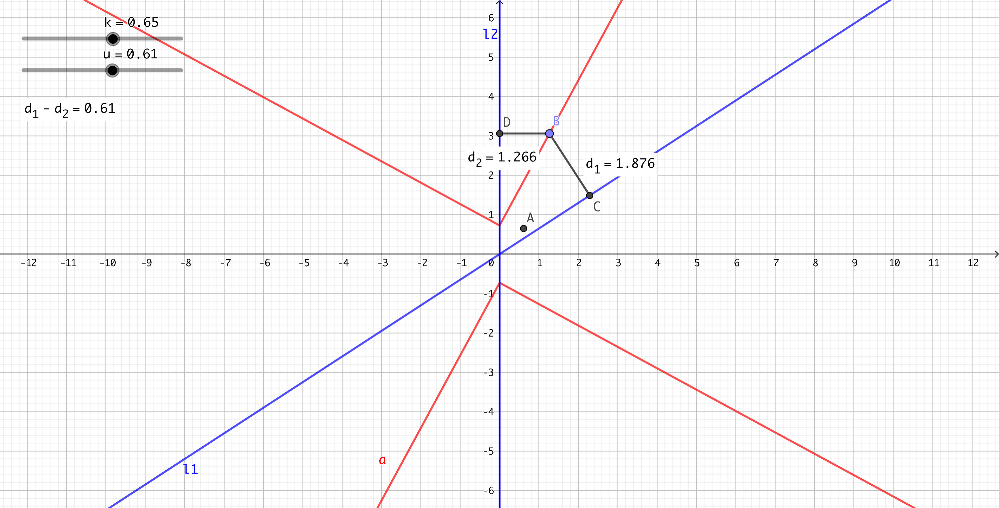
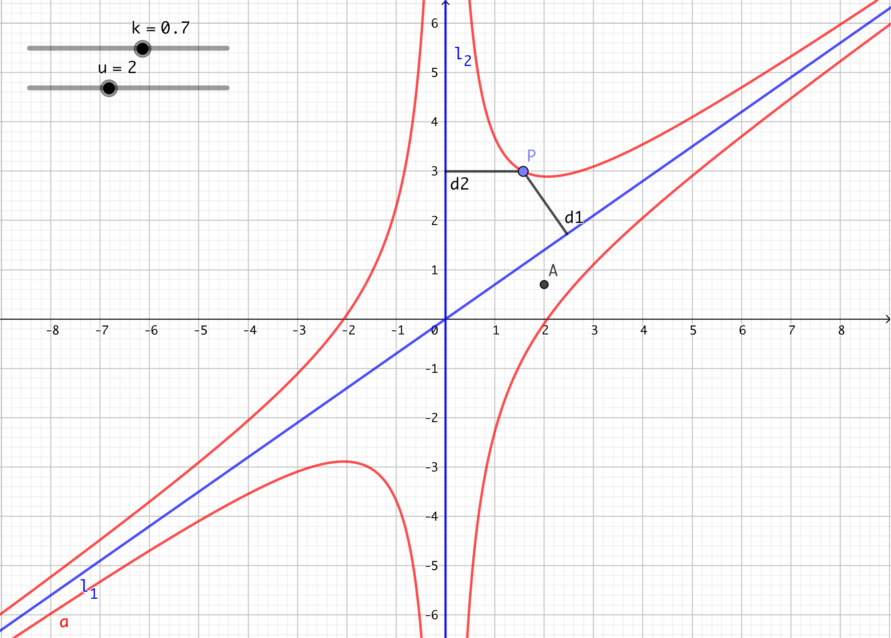
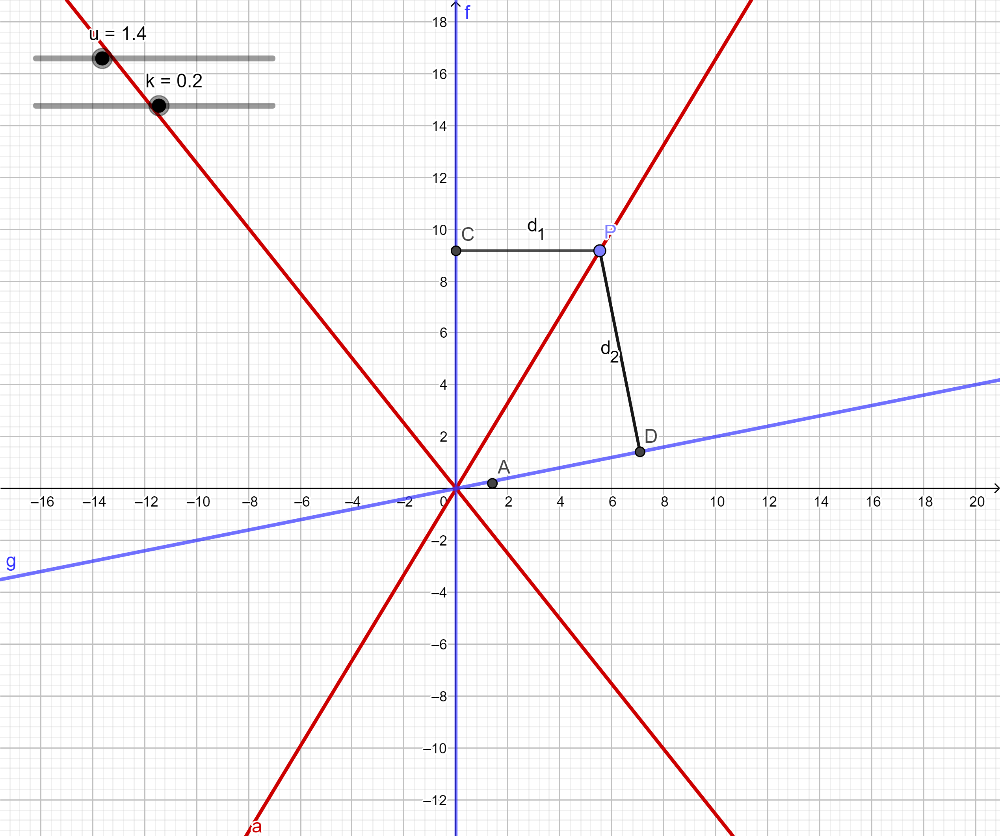

## 线+线

### 约定

为了简化问题, 我们把 $l_1,l_2$ 通过旋转和平移使 $l_2$ 与 $y$ 轴重合, 因为 $l_1$ 与 $l_2$ 不重合， $l_1$ 斜率必存在.
$$
l_1:y=kx,l_2:x=0
$$

设点 $P(x_0,y_0)$ 到 $l_1$ , $l_2$ 的距离分别为 $d_1$ , $d_2$.

首先转换直线 $l_1$ 的形式
$$
l_1:kx-y=0
$$
可以求出 $d_1$ , $d_2$ 
$$
d_1=\frac{|kx_0-y_0|}{\sqrt{k^2+1}},d_2=|x_0|
$$

### 和

设点 $P(x_0,y_0)$ 到 $l_1,l_2$ 的距离 $d_1,d_2$ 之和
$$
d_1 + d_2 = u
$$

- - -
#### 1.计算
即为
$$
\frac{|kx_0-y_0|}{\sqrt{k^2+1}} + |x_0| = u\\\\
|kx_0-y_0| + \sqrt{k^2 + 1}|x_0| = \sqrt{k^2+1}u
$$
发现图像关于原点中心对称，不妨设 $x_0 > 0$，分类讨论：

当 $kx_0-y_0 > 0$ (即 $P$ 在 $l_1$ 下方)时：
$$
kx_0-y_0 + \sqrt{k^2 + 1}x_0 = \sqrt{k^2+1}u\\\\
y_0 = (\sqrt{k^2+1} + k )x_0 - \sqrt{k^2+1}u
$$

当 $kx_0-y_0 < 0$ (即 $P$ 在 $l_1$ 上方)时：
$$
y_0-kx_0 + \sqrt{k^2 + 1}x_0 = \sqrt{k^2+1}u\\\\
y_0 = -(\sqrt{k^2+1} - k)x_0 +\sqrt{k^2+1}u
$$
#### 2.图像

### 差

设点 $P(x_0,y_0)$ 到 $l_1,l_2$ 的距离 $d_1,d_2$ 之差
$$
d_1 - d_2 = u
$$

#### 1.计算

即为
$$
\frac{|kx_0-y_0|}{\sqrt{k^2+1} }- |x_0| = u\\\\
|kx_0-y_0| - \sqrt{k^2 + 1}|x_0| = \sqrt{k^2+1}u
$$

发现图像关于原点中心对称，不妨设 $x_0 > 0$，分类讨论：

当 $kx_0-y_0 > 0$ (即 $P$ 在 $l_1$ 下方)时：
$$
kx_0-y_0 - \sqrt{k^2 + 1}x_0 = \sqrt{k^2+1}u\\\\
y_0 = -(\sqrt{k^2+1} - k )x_0 - \sqrt{k^2+1}u
$$

当 $kx_0-y_0 < 0$ (即 $P$ 在 $l_1$ 上方)时：
$$
kx_0-y_0 + \sqrt{k^2 + 1}x_0 = -\sqrt{k^2+1}u\\\\
y_0 = (\sqrt{k^2+1} + k)x_0 + \sqrt{k^2+1}u
$$

#### 2.图像：

曲线的图像为两组平行射线，没有什么特殊的几何性质。

### 积

设点 $P(x_0,y_0)$ 到 $l_1,l_2$ 的距离 $d_1,d_2$ 之积
$$
d_1d_2=u(u \neq 0)
$$

#### 1.计算

即为
$$
\frac{|kx_0-y_0|}{\sqrt{k^2+1}}|x_0| = u\\\\
|(kx_0-y_0)x_0| = u\sqrt{k^2+1}
$$

发现图像关于原点中心对称，不妨设 $x_0 > 0$，分类讨论：

当 $kx_0-y_0 > 0$ (即 $P$ 在 $l_1$ 下方)时：
$$
k{x_0}^2 - x_0y_0 = u\sqrt{k^2 + 1}\\\\
y_0 = kx_0 - u\sqrt{k^2 + 1} \cdot \frac{1}{x_0}
$$

当 $kx_0-y_0 < 0$ (即 $P$ 在 $l_1$ 上方)时：
$$
k{x_0}^2 - x_0y_0 = - u\sqrt{k^2 + 1}\\\\
y_0 = kx_0 + u\sqrt{k^2 + 1} \cdot \frac{1}{x_0}
$$

#### 2.图像：

曲线的图像为一组形如 $ax+b\frac{1}{x}$ 和 $ax-b\frac{1}{x}$ 的曲线，$l_1$ 和 $l_2$ 均为其渐近线。

### 比

设点 $P(x_0,y_0)$ 到 $l_1,l_2$ 的距离 $d_1,d_2$ 之比
$$
\frac{d_1}{d_2}=u (u \neq 0)
$$

#### 1.计算：

即为
$$
\frac{\frac{|kx_0-y_0|}{\sqrt{k^2+1}}}{|x_0|}=u\\\\
|kx_0-y_0|=u\sqrt{k^2+1}|x_0|
$$

发现该图像关于原点中心对称，不妨设 $x_0 > 0$ ，分类讨论可得：

当 $kx_0-y_0 > 0$ (即 $P$ 在 $l_1$ 下方)时：
$$
y_0-kx_0=u\sqrt{k^2+1}x_0\\\\
y_0=[k+u\sqrt{k^2+1}]x_0
$$

当 $kx_0-y_0 < 0$ (即 $P$ 在 $l_1$ 上方)时：
$$
kx_0-y_0=u\sqrt{k^2+1}x_0\\\\
y_0=[k-u\sqrt{k^2+1}]x_0
$$

#### 2.图像：

曲线的图像为两条相交于原点的直线

- 图例：
  + 点$A(u,k)$:拖动来调整 $u,k$ 参数
  + $l_1,l_2$:蓝色直线两条
  + 所求曲线 $l$ :红色直线
  + 点$P$ :曲线上的点，可拖动
