## 线+点

### 约定

为了简化问题, 我们把 $l$ 通过旋转和平移使 $l$ 与 $y$ 轴重合, 并且使定点 $A$ 位于 $x$ 轴正半轴上.
$$
l_1:x=0,A(p,0)(p>0)
$$

设点 $P(x_0,y_0)$ 到直线 $l$ , 定点 $A$ 的距离分别为 $d_1$ , $d_2$.

可以求出 $d_1$ , $d_2$ 
$$
d_1=|x_0|,d_2 = \sqrt{(x_0-p)^2 + y^2}
$$

### 和

设点 $P(x_0,y_0)$ 到直线 $l$ 和定点 $A$ 的距离 $d_1,d_2$ 之和
$$
d_1 + d_2 = u(u > p)
$$

#### 1.计算

即为
$$
|x_0| + \sqrt{(x_0-p)^2 + y^2} = u\\
|x_0| - u = - \sqrt{(x_0-p)^2 + y^2}\\
$$
**注意到定义域限制： $|x_0| \leq u $ .**
$$
(|x_0|-u)^2 = (x_0-p)^2 + y^2\\
-2|x_0|u + u^2 = -2px_0 + p^2 +y^2\\
y^2 = -2u|x_0|+ 2px_0 - p^2 + u^2 \\
$$
当 $x_0 < 0$ 时，图像在 $x$ 轴左侧时：
$$
y^2 =  (2u + 2p)x_0 - p^2 + u^2 \\
$$
当 $x_0 > 0$ 时，图像在 $x$ 轴右侧时：
$$
y^2 =  (2u + 2p)x_0 - p^2 + u^2
$$

#### 2.图像

曲线的图像为两条抛物线。

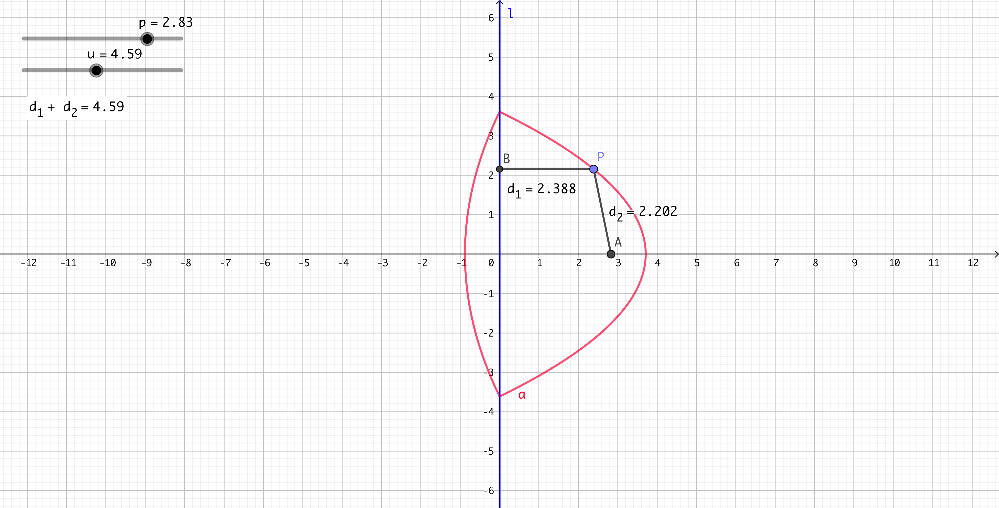

### 差（1）

设点 $P(x_0,y_0)$ 到直线 $l$ 和定点 $A$ 的距离 $d_1,d_2$ 之差
$$
d_1 - d_2 = u(0 < u < p)
$$

#### 1.计算

即为
$$
|x_0| - \sqrt{(x_0-p)^2 + y^2} = u\\
|x_0| - u = \sqrt{(x_0-p)^2 + y^2}
$$
**注意到定义域限制： $ |x_0| > u$**
$$
(|x_0|-u)^2 = (x_0-p)^2 + y^2\\
-2|x_0|u + u^2 = -2px_0 + p^2 +y^2\\
y^2 =  -2u|x_0| + 2px_0 - p^2 + u^2 \\
$$
当 $x_0 < 0$ 时，图像在 $x$ 轴左侧时：
$$
y^2 =  (2u + 2p)x_0 - p^2 + u^2 \\
$$
但注意到由于 $-p^2 + u^2 > 0$ ，所以整段抛物线均在 $x$ 轴之右，不存在该段图像。

当 $x_0 > 0$ 时，图像在 $x$ 轴右侧时：
$$
y^2 =  (-2u + 2p)x_0 - p^2 + u^2
$$

#### 2.图像

该曲线为一条抛物线。

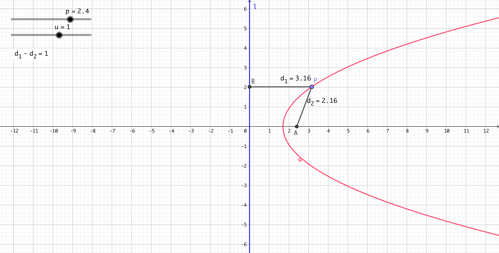

### 差（2)

设点 $P(x_0,y_0)$ 到直线 $l$ 和定点 $A$ 的距离 $d_1,d_2$ 之差
$$
d_2 - d_1 = u(u > 0)
$$

#### 1.计算

即为
$$
\sqrt{(x_0-p)^2 + y^2} - |x_0| = u\\
|x_0| + u = \sqrt{(x_0-p)^2 + y^2}
$$

$$
(|x_0|+u)^2 = (x_0-p)^2 + y^2\\
2|x_0|u + u^2 = -2px_0 + p^2 +y^2\\
y^2 = 2u|x_0| + 2px_0 - p^2 + u^2 \\
$$

当 $x_0 < 0$ 时，图像在 $x$ 轴左侧时：
$$
y^2 =  (-2u + 2p)x_0 - p^2 + u^2 \\
$$
分类讨论可以发现当 $u < p,u = p,u > p$ 时，图像分别不同。

当 $x_0 > 0$ 时，图像在 $x$ 轴右侧时：
$$
y^2 =  (2u + 2p)x_0 - p^2 + u^2
$$

#### 2.图像

当 $u < p$ 时，一根抛物线：

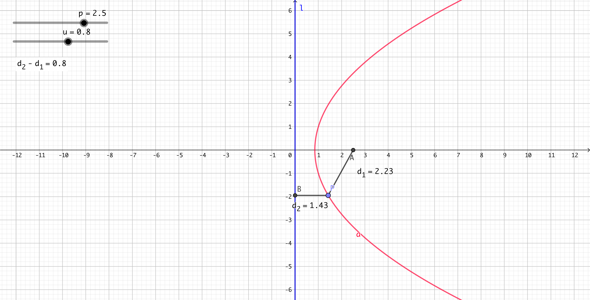

当 $u=p$ 时，一根抛物线和 $x$ 轴负半轴：

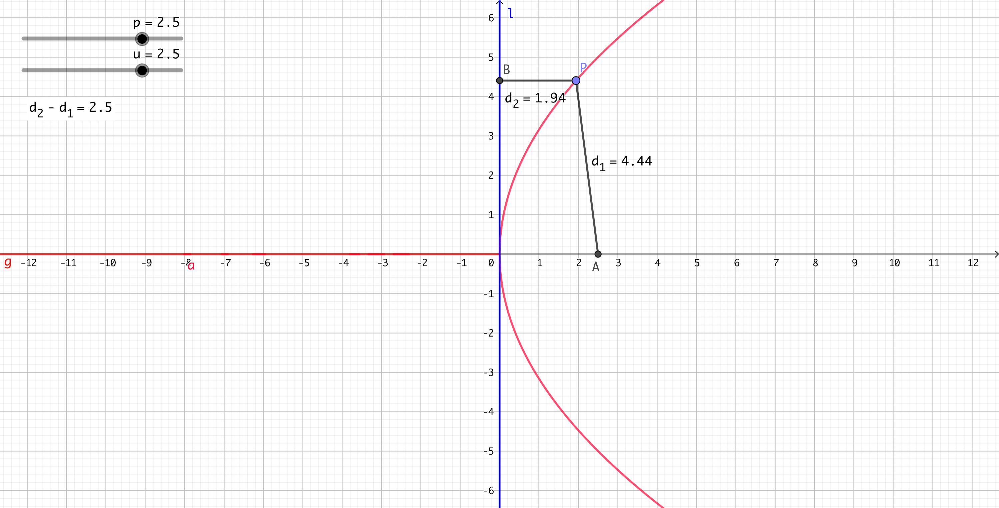

当 $u > p$ 时，两条抛物线的一部分：

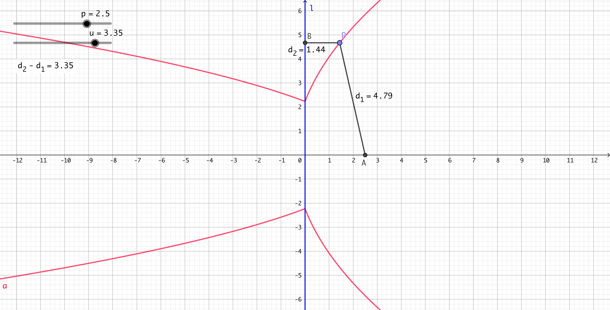

### 积

设点 $P(x_0,y_0)$ 到直线 $l$ 和定点 $A$ 的距离 $d_1,d_2$ 之积
$$
d_1 d_2 = u(u > 0)
$$

#### 1.计算

即为
$$
|x_0|\sqrt{(x_0-p)^2 + y^2} = u\\
{x_0}^2[(x_0-p)^2 + y^2)] = u^2\\
y^2 = \frac{u^2}{{x_0}^2} - (x_0-p)^2
$$

#### 2.图像

经计算得到有三种情况：

当 $4u < p^2$ 时，图像如图所示：

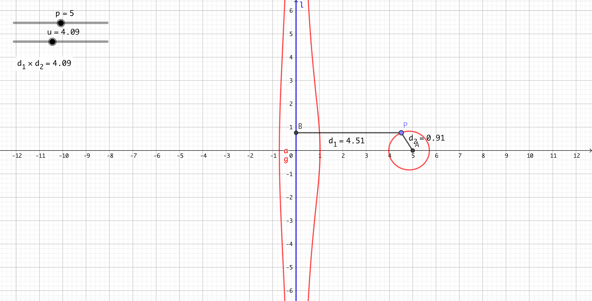

当 $4u = p^2$ 时，图像如图所示：

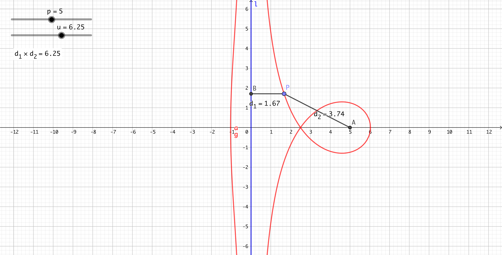

当 $4u > p^2$ 时，图像如图所示：

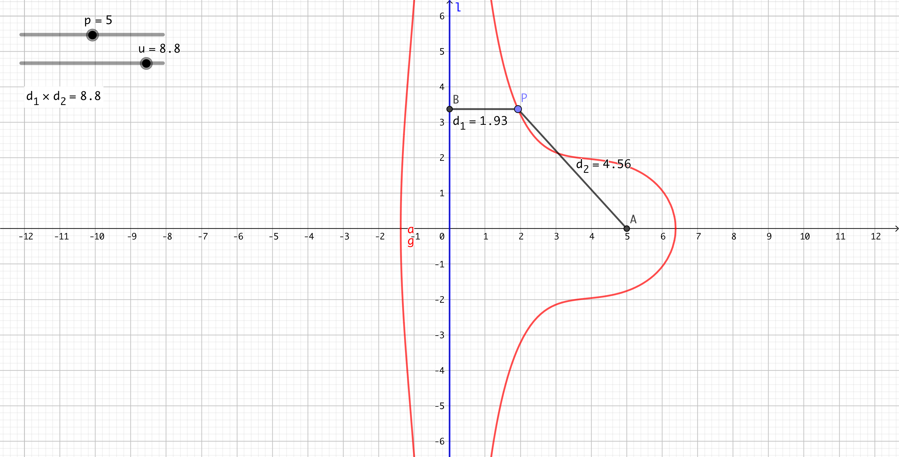

### 商

设点 $P(x_0,y_0)$ 到直线 $l$ 和定点 $A$ 的距离 $d_1,d_2$ 之商
$$
\frac{d_1}{d_2} = u(u > 0)
$$
由课内所学知识（圆锥曲线的第二定义），可以发现其必然为圆锥曲线。

当 $0 < u < 1$ 时，曲线为双曲线：

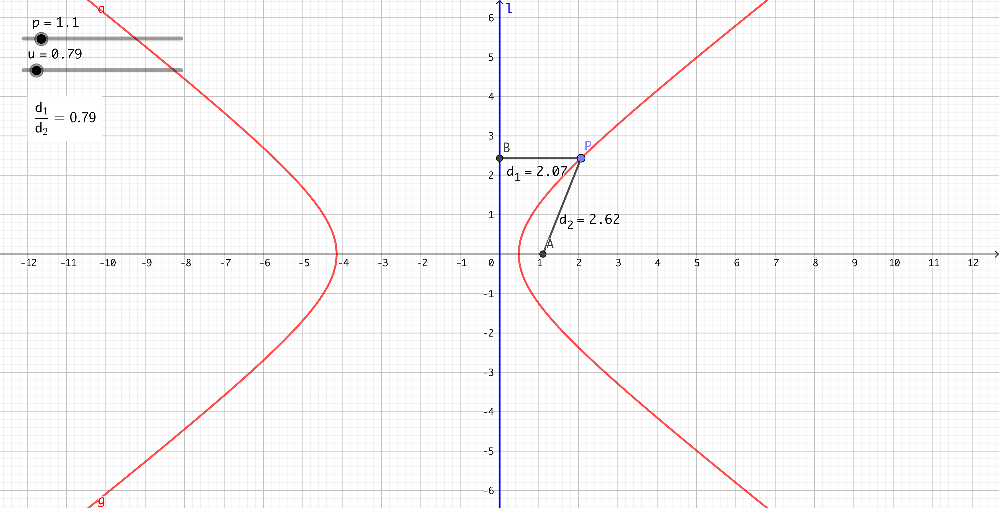

当 $u=1$ 时，曲线为抛物线：

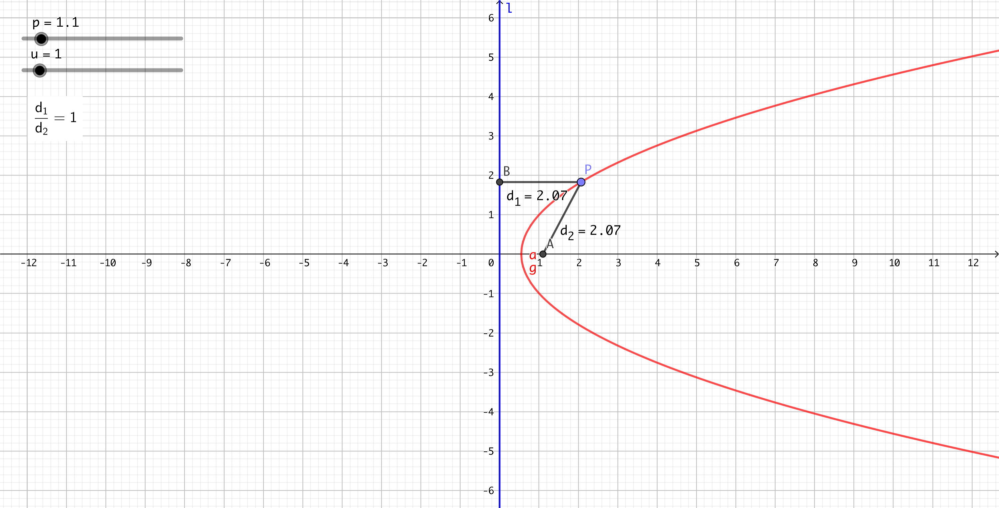

当 $u > 1$ 时，曲线为椭圆：

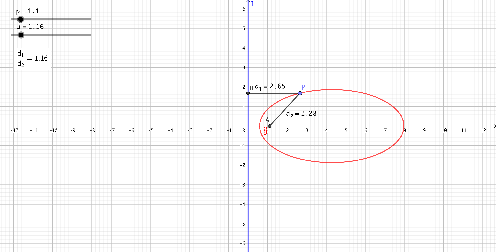

- 图例：
  + 点$A(p,0)$:拖动来调整 $p$ 参数
  + $l$ :蓝色直线
  + 所求曲线 $a$ :红色直线
  + 点$P$ :曲线上的点，可拖动
